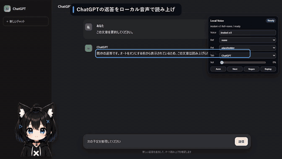

# ChatGPT Local Voice Bridge

ChatGPTの新しい返答を検出し、その冒頭をPC内で音声に変換して自動で読み上げるChrome / Brave拡張です。

[](docs/media/demo.mp4)

上の動くプレビューはGIFのため無音です。音声を確認するには、画像をクリックするか、[音声付きMP4を開いてください](docs/media/demo.mp4)。

映像は実ChatGPTアカウントではなく、安全なローカルフィクスチャで拡張機能の実コードを動かしたものです。実際のローカル音声生成にはIrodori v3を使用しています。

## 主な機能

- Autoをオンにした後の新しい返答だけを検出し、最大2行・80文字の冒頭を一度だけ再生
- Autoをオンにする前から表示されていた返答は読み上げない
- `Next`で続き、`Replay`で聞き直し、`Regen`で現在の部分を再生成
- API・生成音声・任意の参照音声を同じPC内で管理
- 実モデル不要のデモとCIで、拡張機能の通信・再生境界を確認可能

## GPU不要の2分デモ

```bat
npm ci
npx playwright install chromium
npm run demo
```

Node.js 22とChromiumだけで起動します。Python、CUDA、GPU、Hugging Faceモデル、ChatGPTへのログインは不要です。表示される画面は「ローカルデモフィクスチャ」であり、実ChatGPT画面ではありません。終了時はChromiumを閉じるか`Ctrl+C`を押してください。

終了コードで検証する場合：

```bat
npm run demo:check
```

## 実際のローカル音声を使うセットアップ

```bat
setup-voice-env.cmd
run-voice-stack.cmd
```

`http://127.0.0.1:8717/health`を開き、`ok=true`と`engine=irodori_direct`を確認します。その後、Chrome / Braveの拡張機能画面でDeveloper modeを有効にし、**Load unpacked**から`extension/`を選択してください。

最初は`Ref=none`のまま、Local VoiceパネルでAutoをオンにしてから新しいメッセージを送ります。新しい返答の先頭プレビューが再生されれば完了です。参照音声の追加方法は[参照音声](docs/reference-audio.md)を参照してください。

## 対応環境

| モード | 必須 | 検証済み | 未対応・未検証 |
| --- | --- | --- | --- |
| 軽量デモ / mock CI | Node.js 22、Chromium | Windows 11のPlaywright Chromium | Firefox、macOSの実行は未検証 |
| 実音声 | Windows、Python、NVIDIA GPU、CUDA、Irodori v3 | Windows 11、Playwright Chromium、NVIDIA CUDA環境 | Chrome / Braveの手動確認、CPUのみ、macOS、Linux、Firefox、Edgeは未検証または未対応 |

GPU、VRAM、ブラウザごとの扱いは[動作環境](docs/hardware.md)にまとめています。未検証の環境を対応済みとはしていません。

## 制約

- ChatGPTのDOM変更により、返答検出が一時的に動作しなくなる可能性があります。
- CIはChatGPTに似た固定フィクスチャを使い、将来の実ChatGPT DOMを保証しません。
- 軽量デモは統合動作の確認用で、Irodoriの音声品質評価ではありません。
- 実モデルE2EにはWindows、NVIDIA GPU、CUDA、モデル取得が必要です。
- ローカルAPIには認証がないため、LAN、インターネット、トンネルへ公開できません。

## 詳細ドキュメント

- [初回セットアップ](docs/setup.md)
- [起動とヘルス確認](docs/startup.md)
- [操作とテスト](docs/operation.md)
- [動作環境](docs/hardware.md)
- [困ったとき](docs/troubleshooting.md)
- [参照音声](docs/reference-audio.md)
- [セキュリティ境界](SECURITY.md)
- [構成](ARCHITECTURE.md)
